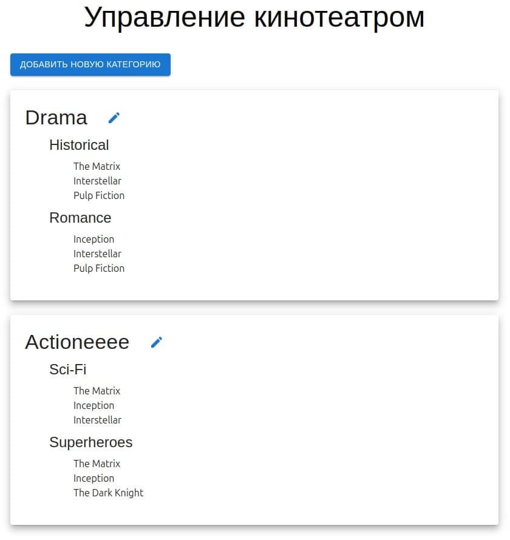
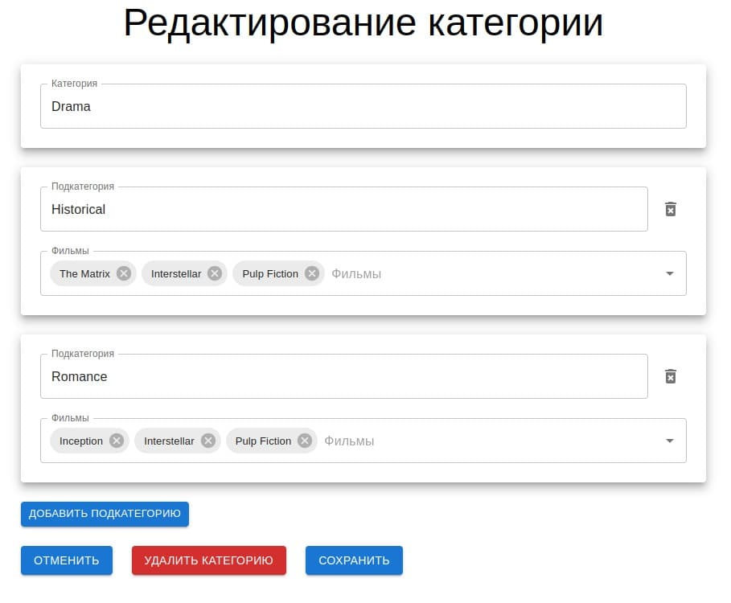

# 🎬 Movie Categories Admin Panel

## 🛠️ Описание проекта

Это административная панель для управления категориями и подкатегориями фильмов. Приложение позволяет создавать, редактировать и удалять категории, а также управлять подкатегориями через удобный интерфейс.

## 🚀 Функционал

- 🔹 Добавление, редактирование и удаление категорий
- 🔹 Управление подкатегориями для каждой категории
- 🔹 Удобный пользовательский интерфейс с динамическим обновлением данных
- 🔹 Валидация форм для корректного ввода данных

## 🧰 Используемые технологии

- ⚛️ React + Vite
- ⚙️ TypeScript
- 🖌️ @mui/material для компонентов интерфейса

## ⚙️ Установка и запуск

1. Клонируйте репозиторий:
   ```bash
   git clone https://github.com/your-username/movie-admin-panel.git
   cd movie-admin-panel

2. Установите зависимости:
   ```npm install
   
3. Запустите проект:
   ```npm run dev
   
4. Структура проекта:
   src/
   └── components/       # UI-компоненты

   

   